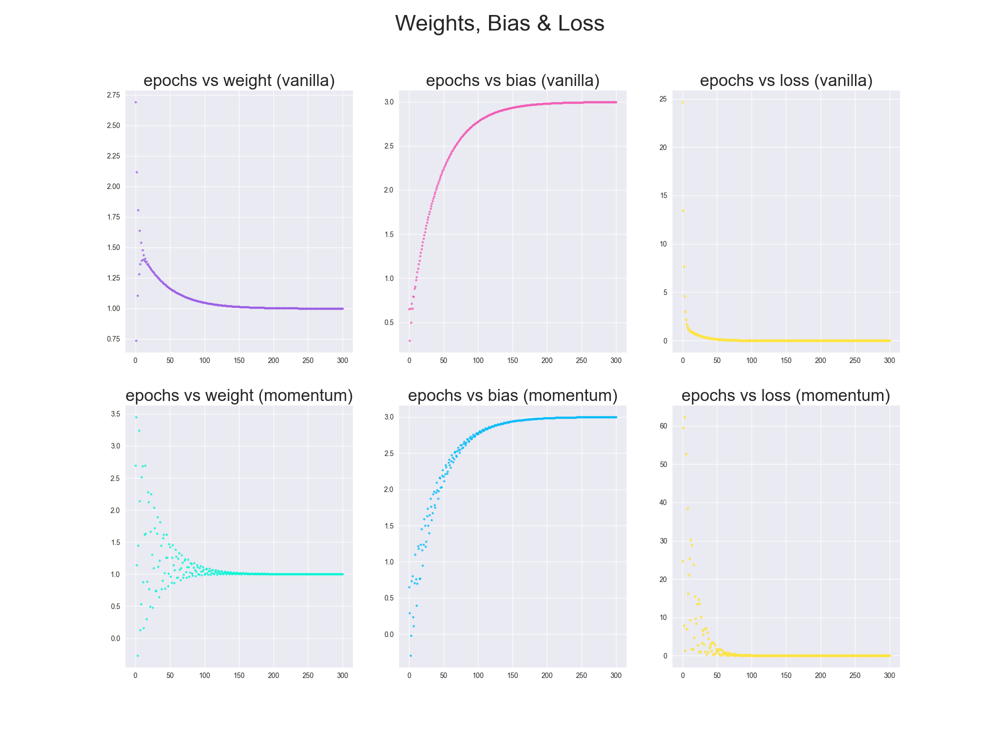

<style>
h1, h2, h3
{
font-family: "Inria Serif", Times, serif;
    font-variant-ligatures: common-ligatures;
}

body{
    font-family: "IBM Plex Sans", sans-serif;
    font-variant-ligatures: common-ligatures;
}

</style>

# <center>Shri Ramdeobaba College of Engineering and Management<br>Nagpur, 440013</center>

## <center>Department of Computer Science Engineering (AIML)</center>

### <center>Deep Learning Lab</center>

---

**Name** : _Shantanu Mane_<br>
**Roll No.** : _E63_<br>
**Batch** : _CSE-AIML_<br>
**Date** : _19/2/2023_<br>

---

### AIM - To implement Vanilla and Momentum based Gradient Descent algorithm to find the best fit curve for the points

`x = {1, 3.5, 6}` <br>
`y = {4, 6.5, 9}`

---

## Importing Dependencies

```python
import numpy as np
import matplotlib.pyplot as plt
import seaborn as sns
```

## Gradient Descent Class

```python
class GradientDescentFamily:
    w = 0.0
    b = 0.0
    velocity, velocity_b = 0.0, 0.0

    X = np.array([])
    Y = np.array([])

    lr = 0.0
    gamma = 0.0

    N = 0

    self.colors = ["#9b5de5", "#f15bb5", "#fee440", "#00bbf9", "#00f5d4"]

    def __init__(self, w, b, lr, gamma):
        self.w = w
        self.b = b

        self.lr = lr
        self.gamma = gamma

        self.X = np.array([1, 3.5, 6])
        self.Y = np.array([4, 6.5, 9])

        self.N = self.X.shape[0]

    def Get_Gradient(self):
        dldw = 0.0
        dldb = 0.0

        # N = self.X.shape[0]

        dldw += -2 * self.X * (self.Y - (self.w * self.X + self.b))
        dldb += -2 * (self.Y - (self.w * self.X + self.b))

        return dldw, dldb

    def Vanilla_Gradient_Descent(self):
        loss = 0.0
        self.w = 0.0
        self.b = 0.0
        for epoch in range(301):
            dldw, dldb = self.Get_Gradient()
            # print(dldw, dldb, self.w, self.b)

            self.w -= self.lr * np.sum(dldw) / self.N
            self.b -= self.lr * np.sum(dldb) / self.N

            y_pred = self.w * self.X + self.b
            loss = np.sum((self.Y - y_pred) ** 2) / self.N

            axs[0, 0].scatter(epoch, self.w, color=self.colors[0], s=5, alpha=0.7)
            axs[0, 0].set_title("epochs vs weight (vanilla)", fontsize=24)
            axs[0, 1].scatter(epoch, self.b, color=self.colors[1], s=5, alpha=0.7)
            axs[0, 1].set_title("epochs vs bias (vanilla)", fontsize=24)
            axs[0, 2].plot(epoch, loss, color=self.colors[2], marker='.', alpha=0.7)
            axs[0, 2].set_title("epochs vs loss (vanilla)", fontsize=24)

            # plt.plot(epoch, loss, color='g')
        # plt.show()

        print(f'w: {self.w}, b : {self.b}, final loss : {loss}')

    def Momentum_Gradient_Descent(self):
        self.w = 0.0
        self.b = 0.0
        loss = 0.0

        for epoch in range(301):
            dldw, dldb = self.Get_Gradient()
            # print(self.w, self.b)

            self.velocity = self.gamma * self.velocity + self.lr * np.sum(dldw) / self.N
            self.w -= self.velocity

            # self.velocity_b = self.gamma * self.velocity_b + self.lr * np.sum(dldb) / self.N
            # self.b -= self.velocity_b

            # self.w -= self.lr * np.sum(dldw) / self.X.shape[0]
            self.b -= self.lr * np.sum(dldb) / self.N

            y_pred = self.w * self.X + self.b
            loss = np.sum((self.Y - y_pred) ** 2) / self.N

            axs[1, 0].scatter(epoch, self.w, color=self.colors[4], s=5, alpha=0.7)
            axs[1, 0].set_title("epochs vs weight (momentum)", fontsize=24)
            axs[1, 1].scatter(epoch, self.b, color=self.colors[3], s=5, alpha=0.7)
            axs[1, 1].set_title("epochs vs bias (momentum)", fontsize=24)
            axs[1, 2].plot(epoch, loss, color=self.colors[2], marker='.', alpha=0.7)
            axs[1, 2].set_title("epochs vs loss (momentum)", fontsize=24)

        print(f'w: {self.w}, b : {self.b}, final loss : {loss}')

    @staticmethod
    def Show_Plot(self):
        plt.show()
```

## Main Function

```python
from Gradient_Descent import GradientDescentFamily

if __name__ == '__main__':
    gd: GradientDescentFamily = GradientDescentFamily(0.0, 0.0, 0.05, 1.009)

    gd.Vanilla_Gradient_Descent()
    gd.Momentum_Gradient_Descent()
    gd.Show_Plot()
```

## Output

```text
Vanilla Gradient Descent -> w: 1.000354290958917, b : 2.998362765540911, final loss : 6.807893139296038e-07
Momentum Gradient Descent -> w: 1.000229682240711, b : 2.9986983624105608, final loss : 4.6756285933106524e-07
```

## Plot


