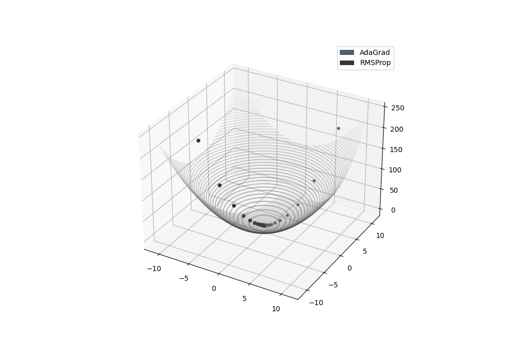

<style>
h1, h2, h3
{
font-family: "Inria Serif", Times, serif;
    font-variant-ligatures: common-ligatures;
}

body{
    font-family: "IBM Plex Sans", sans-serif;
    font-variant-ligatures: common-ligatures;
}

</style>

# <center>Shri Ramdeobaba College of Engineering and Management<br>Nagpur, 440013</center>

## <center>Department of Computer Science Engineering (AIML)</center>

### <center>Deep Learning Lab</center>

---

**Name** : _Shantanu Mane_<br>
**Roll No.** : _E63_<br>
**Batch** : _CSE-AIML_<br>
**Date** : _19/2/2023_<br>

---

### AIM - To implement AdaGrad and RMSProp based Gradient Descent algorithm to minimize the quadratic function in 3D.

---

## Importing Dependencies

```python
import numpy as np
import matplotlib.pyplot as plt
import seaborn as sns
```

## Gradient Descent Class

```python

class GradientDescentFamilyUpdated:
    """
    :arg x: x
    :arg y: y
    :arg lr: learning rate
    :arg beta: beta
    :arg eps: epsilon
    :arg velocity_x: velocity x
    :arg velocity_y: velocity y

    :de
    """
    x = 0.0
    y = 0.0

    lr, eps = 0.0, 0.0

    velocity_x, velocity_y = 0.0, 0.0

    beta = 0.0

    def __init__(self, x, y, lr, beta, eps):
        """

        :param x:
        :param y:
        :param lr:
        :param beta:
        :param eps:
        """
        self.x = x
        self.y = y
        self.lr = lr
        self.beta = beta
        self.eps = eps

    def Get_Gradient(self, x, y):
        """

        Arguments:
        ----------
        :param x:
        :param y:

        Returns:
        --------
        :returns: dldx, dldy
        """
        dldx = 2 * x
        dldy = 2 * y

        return dldx, dldy

    def Plot_MeshGrid(self, x, y):
        X = np.linspace(-11.0, 11.0)
        Y = np.linspace(-11.0, 11.0)

        # Creating 2-D grid of features
        X, Y = np.meshgrid(X, Y)

        Z = X ** 2 + Y ** 2

        # plots filled contour plot
        ax.contour3D(X, Y, Z, 50, cmap='gray', alpha=0.3)

    def AdaGrad(self, x: float, y: float) -> None:
        """

        :param x:
        :param y:
        :param lr:
        :return: None
        """
        self.velocity_x, self.velocity_y = 0.0, 0.0
        for epoch in range(30):
            z = x ** 2 + y ** 2

            del_x, del_y = self.Get_Gradient(x, y)

            self.velocity_x += del_x ** 2
            x -= (self.lr / (self.lr * self.eps) ** 0.5) * del_x

            self.velocity_y += del_y ** 2
            y -= (self.lr / (self.lr * self.eps) ** 0.5) * del_y

            ax.scatter3D(x, y, z, color='#4f5d75', marker="*")

    def RMSProp(self, x: float, y: float) -> None:
        """

        :param x:
        :param y:
        :return: None
        """
        self.velocity_x, self.velocity_y = 0.0, 0.0
        for epoch in range(35):
            z = x ** 2 + y ** 2

            del_x, del_y = self.Get_Gradient(x, y)

            self.velocity_x = (self.beta * self.velocity_x) + ((1 - self.beta) * del_x ** 2)
            x -= (self.lr / (self.lr * self.eps) ** 0.5) * del_x

            self.velocity_y = (self.beta * self.velocity_y) + ((1 - self.beta) * del_y ** 2)
            y -= (self.lr / (self.lr * self.eps) ** 0.5) * del_y

            ax.scatter3D(x, y, z, color='#353535', marker="o")

    def Show_Plot(self):
        ax.legend(handles=[
            Patch(facecolor='#4f5d75', label="AdaGrad"),
            Patch(facecolor='#353535', label="RMSProp")
        ], loc="upper right")
        plt.show()
```

## Main Function

```python
from Gradient_Descent_AdaGrad_RMSProp import GradientDescentFamilyUpdated

if __name__ == '__main__':
    gd: GradientDescentFamilyUpdated = GradientDescentFamilyUpdated(0.0, 0.0, 0.01, 0.3, 0.4)

    gd.Plot_MeshGrid(0.0, 0.0)
    gd.AdaGrad(13, 8)
    gd.RMSProp(-13, -5)
    gd.Show_Plot()
```

## Output

```text
ADAGRAD: 
final x:  0.00014497302250782789 final y:  8.921416769712485e-05
RMSPROP: 
final x:  -2.166928094848852e-05 final y:  -8.334338826341736e-06
```

