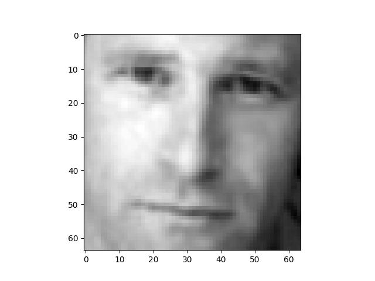
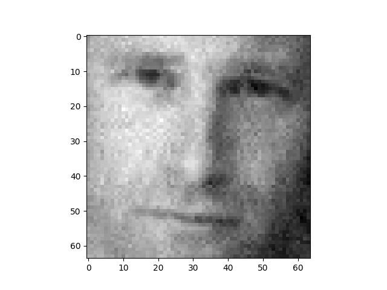
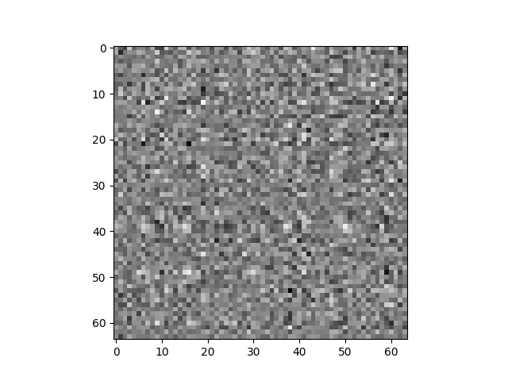

<style>
h1, h2, h3
{
font-family: "Inria Serif", Times, serif;
    font-variant-ligatures: common-ligatures;
}

body{
    font-family: "IBM Plex Sans", sans-serif;
    font-variant-ligatures: common-ligatures;
}

</style>

# <center>Shri Ramdeobaba College of Engineering and Management<br>Nagpur, 440013</center>

## <center>Department of Computer Science Engineering (AIML)</center>

### <center>Deep Learning Lab</center>

---

**Name** : _Shantanu Mane_<br>
**Roll No.** : _E63_<br>
**Batch** : _CSE-AIML_<br>
**Date** : _5/3/2023_<br>

---

### AIM - To implement facial reconstruction using PCA, on the faces' dataset.

---

## Importing Dependencies

```python
import numpy as np
import matplotlib.pyplot as plt
import seaborn as sns
```

## PCA Class

```python

class FacialImageCompressionUsingPCA:

    def __init__(self):
        self.facesList = os.listdir("D:\DLLab\Practical 3\data\lfwcrop_grey/faces")
        self.X = []

    def CreateXMatrix(self):
        for face in self.facesList[:10]:
            image = cv.imread(f"D:/DLLab/Practical 3/data/lfwcrop_grey/faces/{face}", 0)
            print(image.shape)
            self.X.append(np.ravel(np.array(image)))

        self.X = np.array(self.X)
        print(self.X)

    def GetMeanFace(self):
        meanFace = np.mean(self.X, axis=0)

        plt.imshow(meanFace, cmap='gray')
        plt.show()

    def GetEigenFaces(self):
        XTX = self.X.T.dot(self.X)
        eigenvalues, eigenvectors = np.linalg.eig(XTX)

        print(f"eigenvalues = {eigenvalues}, eigenvectors = {eigenvectors.shape}")

        image = np.zeros((64, 64))
        for i in eigenvectors:
            image += i.reshape(64, 64).dot(self.X[0].reshape(64, 64).T).dot(i.reshape(64, 64))

        plt.imshow(image, cmap='gray')
        plt.show()

    def PCA(self):
        print(self.X[0])
```

## Main Function

```python
from Facial_Image_Reconstruction_Using_PCA import FacialImageCompressionUsingPCA

if __name__ == '__main__':
    fr = FacialImageCompressionUsingPCA()

    fr.CreateXMatrix()
    # fr.GetMeanFace()
    # fr.PCA()
    fr.GetEigenFaces()
```

## Output

|   |  |  |
|:--------------------:|:-----------------------:|:-----------------------:|
| with all eigen-faces |  with top eigen-faces   |   minimal eigen-faces   |