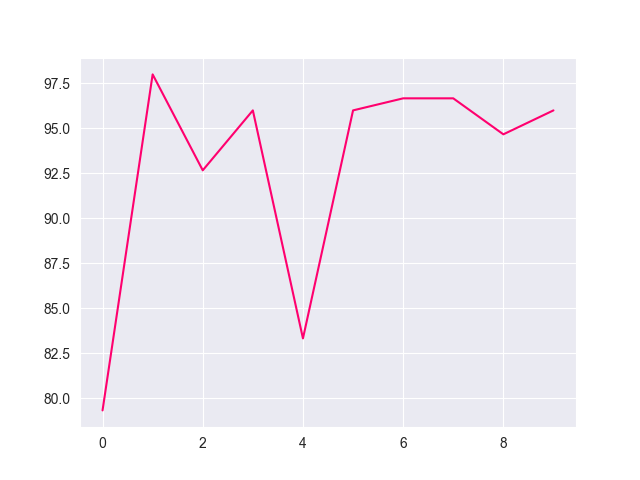
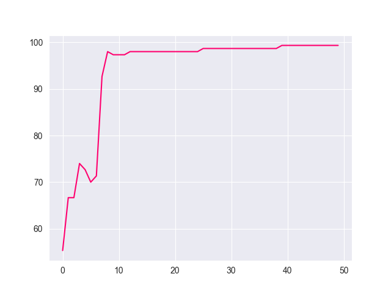

<style>
h1, h2, h3
{
font-family: "Inria Serif", Times, serif;
    font-variant-ligatures: common-ligatures;
}

body{
    font-family: "IBM Plex Sans", sans-serif;
    font-variant-ligatures: common-ligatures;
}

</style>

# <center>Shri Ramdeobaba College of Engineering and Management<br>Nagpur, 440013</center>

## <center>Department of Computer Science Engineering (AIML)</center>

### <center>Deep Learning Lab</center>

---

**Name** : _Shantanu Mane_<br>
**Roll No.** : _E63_<br>
**Batch** : _CSE-AIML_<br>
**Date** : _27/3/2023_<br>

---

### AIM - To implement backpropagation algorithm for a single hidden layer feed forward neural network.

---

## Importing Dependencies

```python
import numpy as np
import matplotlib.pyplot as plt
import seaborn as sns
```

## Neural Network Class

```python
import numpy as np
import pandas as pd
import matplotlib.pyplot as plt
import seaborn as sns

sns.set_style('darkgrid')


class NeuralNetwork:
    def __init__(self):

        self.accuracy = []

        data = pd.read_csv('../data/iris.csv')
        data = data.drop(['Id'], axis=1)
        data = np.array(data)

        self.X = data[:, 0:4].astype(np.float64)
        self.Y = data[:, 4]

        self.lr = 0.1

        label_map = lambda x: {'Iris-setosa': 0, 'Iris-versicolor': 1, 'Iris-virginica': 2}[x]
        self.Y = np.array(list(map(label_map, self.Y)))

        y = np.zeros((len(self.Y), 3))
        for i, label in enumerate(self.Y):
            # print(y, i)
            y[i, label] = 1

        self.Y = y

        self.w_i_h = np.random.uniform(-5, 5, (6, 4))
        self.w_h_o = np.random.uniform(-5, 5, (3, 6))

        # print(self.Y)

    def NeuralNetwork(self):
        for epoch in range(10):
            nr_correct = 0
            for x, y in zip(self.X, self.Y):
                x.shape = (4, 1)
                y.shape = (3, 1)

                h_o = self.w_i_h @ x
                h = 1 / (1 + np.exp(-h_o))

                y_ = self.w_h_o @ h
                y_hat = 1 / (1 + np.exp(-y_))

                error = 1 / len(y_hat) * np.sum((y_hat - y) ** 2, axis=0)
                nr_correct += int(np.argmax(y_hat) == np.argmax(y))

                delta_y = y_hat - y
                self.w_h_o += -self.lr * delta_y @ h.T

                delta_h = self.w_h_o.T @ delta_y * (h * (1 - h))
                self.w_i_h += -self.lr * np.dot(delta_h, x.T)

            print(f"{epoch}. accuracy: {round((nr_correct / len(self.Y)) * 100, 2)}")
            self.accuracy.append(round((nr_correct / len(self.Y)) * 100, 2))

    def PlotAccuracy(self):
        plt.plot(self.accuracy, color="#ff006e")
        plt.show()
```

## Main Function

```python
from Backpropagation_From_Scratch import NeuralNetwork

if __name__ == '__main__':
    nn: NeuralNetwork = NeuralNetwork()

    nn.NeuralNetwork()
    nn.PlotAccuracy()
```

## Output

```text
0. accuracy: 79.33
1. accuracy: 98.0
2. accuracy: 92.67
3. accuracy: 96.0
4. accuracy: 83.33
5. accuracy: 96.0
6. accuracy: 96.67
7. accuracy: 96.67 
8. accuracy: 94.67 
9. accuracy: 96.0
```

## Accuracy Plot



## Long Train

