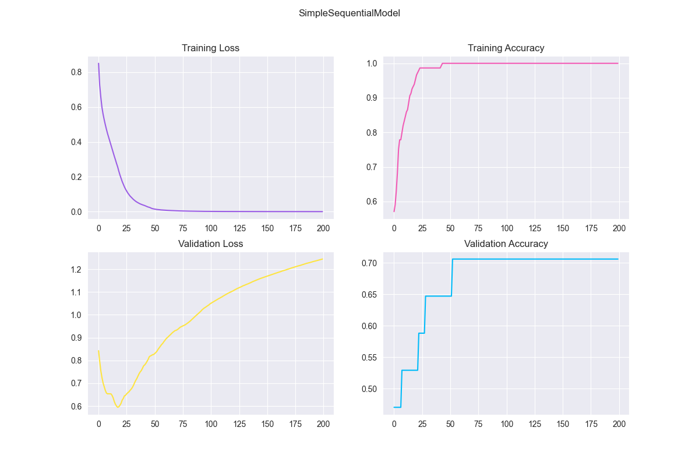

<style>
h1, h2, h3
{
font-family: "Inria Serif", Times, serif;
    font-variant-ligatures: common-ligatures;
}

body{
    font-family: "IBM Plex Sans", sans-serif;
    font-variant-ligatures: common-ligatures;
}

</style>

# <center>Shri Ramdeobaba College of Engineering and Management<br>Nagpur, 440013</center>

## <center>Department of Computer Science Engineering (AIML)</center>

### <center>Deep Learning Lab</center>

---

**Name** : _Shantanu Mane_<br>
**Roll No.** : _E63_<br>
**Batch** : _CSE-AIML_<br>
**Date** : _5/3/2023_<br>

---

### AIM - To implement and evaluate the performance of the following neural network architectures with 2 hidden layers on the SONAR dataset for 200 epochs.

1. Backpropagation NN with adam optimizer.
2. l1 and l2 regularizations.
3. early stopping with p = 5
4. dropout regularization with p = 0.2 for input and second hidden layer.

---

## Importing Dependencies

```python
import numpy as np
import matplotlib.pyplot as plt
import seaborn as sns
```

## Neural Network Class

```python
import pandas as pd
import numpy as np
import matplotlib.pyplot as plt
import seaborn as sns
import tensorflow as tf
from sklearn.datasets import make_classification
from sklearn.model_selection import train_test_split
import time

sns.set_style('darkgrid')

colors = ["#9b5de5", "#f15bb5", "#fee440", "#00bbf9", "#00f5d4"]


class NeuralNetwork:
    """
    A class to represent a neural network.
    """

    def __init__(self):
        """
        Constructs all the necessary attributes for the neural network object.
        """

        # Load the Sonar dataset
        self.X, self.y = make_classification(n_samples=208, n_features=60, n_informative=60, n_redundant=0, n_classes=2,
                                             random_state=42)
        # Split the dataset into training and testing sets
        self.X_train, self.X_test, self.y_train, self.y_test = train_test_split(self.X, self.y, test_size=0.2,
                                                                                random_state=42)

    def SimpleSequentialModel(self):
        nn = tf.keras.models.Sequential([
            tf.keras.layers.Dense(32, input_dim=60, activation='relu'),
            tf.keras.layers.Dense(16, activation='relu'),
            tf.keras.layers.Dense(8, activation='relu'),
            tf.keras.layers.Dense(1, activation='sigmoid')
        ])

        nn._name = "SimpleSequentialModel"

        # Compile the model
        nn.compile(loss='binary_crossentropy', optimizer='adam', metrics=['accuracy'])

        # show the model summary
        nn.summary()

        # Train the model and time it
        start = time.perf_counter()
        history = nn.fit(self.X_train, self.y_train, validation_split=0.1, epochs=200, verbose=0)
        end = time.perf_counter()

        # Evaluate the model
        loss, accuracy = nn.evaluate(self.X_test, self.y_test, verbose=0)
        print(f'Testing Accuracy: {round(accuracy * 100, 2)}%, Testing Loss: {round(loss, 2)}')

        # Plot the loss and accuracy of training and validation
        plt.figure(figsize=(12, 8))

        plt.subplot(221).set_title('Training Loss')
        plt.plot(history.history['loss'], label='train loss', color=colors[0])

        plt.subplot(222).set_title('Training Accuracy')
        plt.plot(history.history['accuracy'], label='train accuracy', color=colors[1])

        plt.subplot(223).set_title('Validation Loss')
        plt.plot(history.history['val_loss'], label='val loss', color=colors[2])

        plt.subplot(224).set_title('Validation Accuracy')
        plt.plot(history.history['val_accuracy'], label='val accuracy', color=colors[3])

        plt.suptitle(nn._name)
        plt.show()

        print(f"time : {end - start}s")
```

## Main Function

```python
from NeuralNetwork_TF import NeuralNetwork

if __name__ == '__main__':
    nnObj: NeuralNetwork = NeuralNetwork()

    nnObj.SimpleSequentialModel()
```

## Output

```text
Model: "SimpleSequentialModel"
_________________________________________________________________
 Layer (type)                Output Shape              Param #   
=================================================================
 dense (Dense)               (None, 32)                1952      
                                                                 
 dense_1 (Dense)             (None, 16)                528       
                                                                 
 dense_2 (Dense)             (None, 8)                 136       
                                                                 
 dense_3 (Dense)             (None, 1)                 9         
                                                                 
=================================================================
Total params: 2,625
Trainable params: 2,625
Non-trainable params: 0
_________________________________________________________________

Testing Accuracy: 69.05%, Testing Loss: 1.22
time : 5.166807199999999s
```

